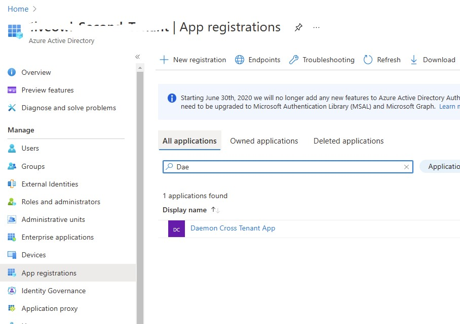
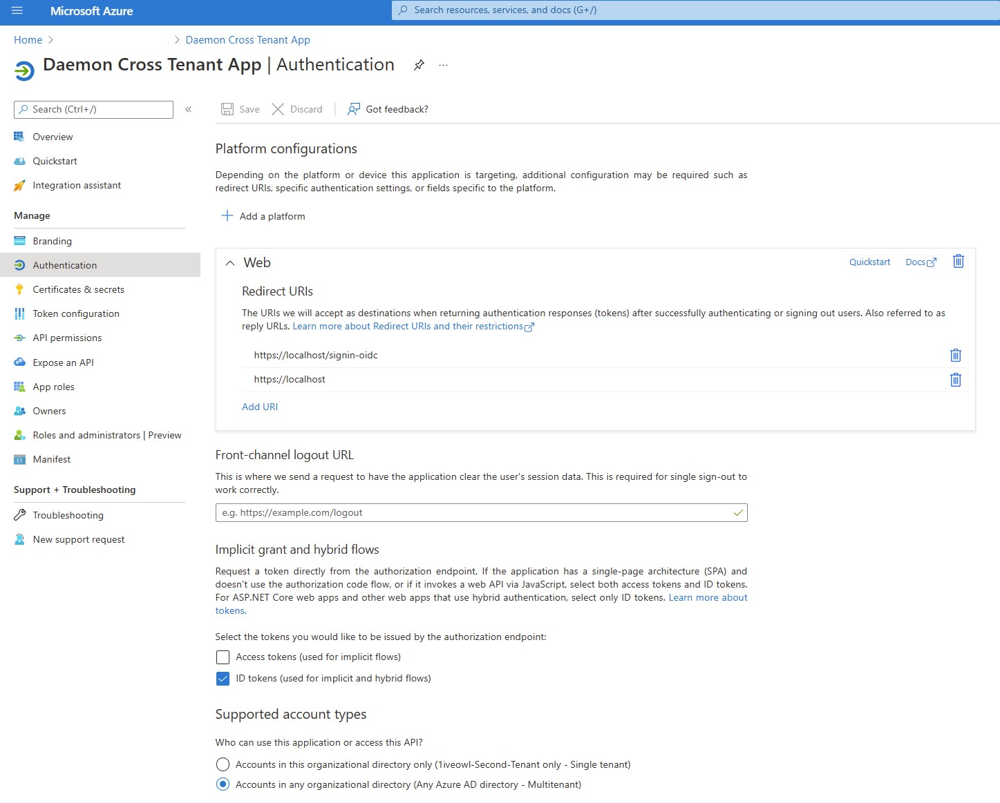
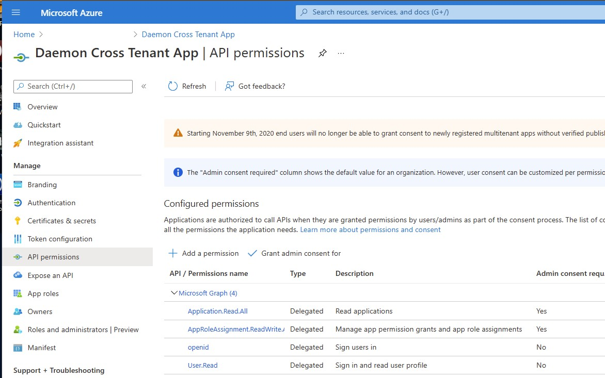
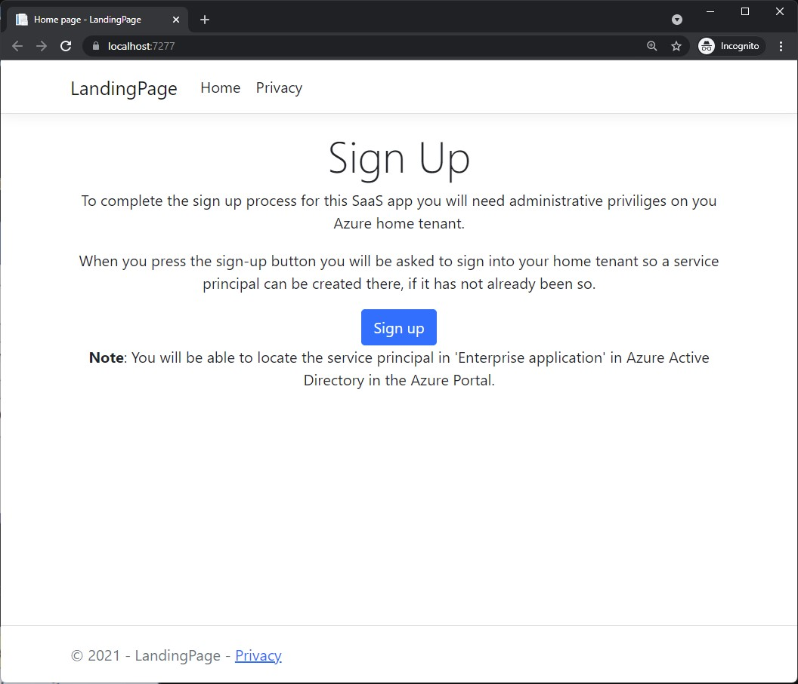
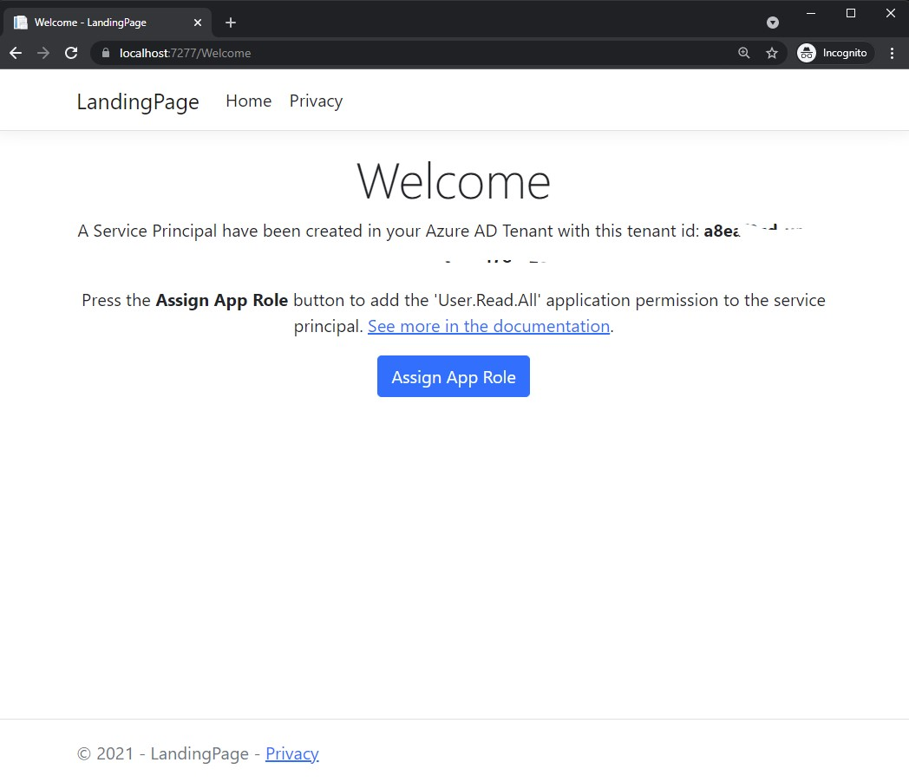
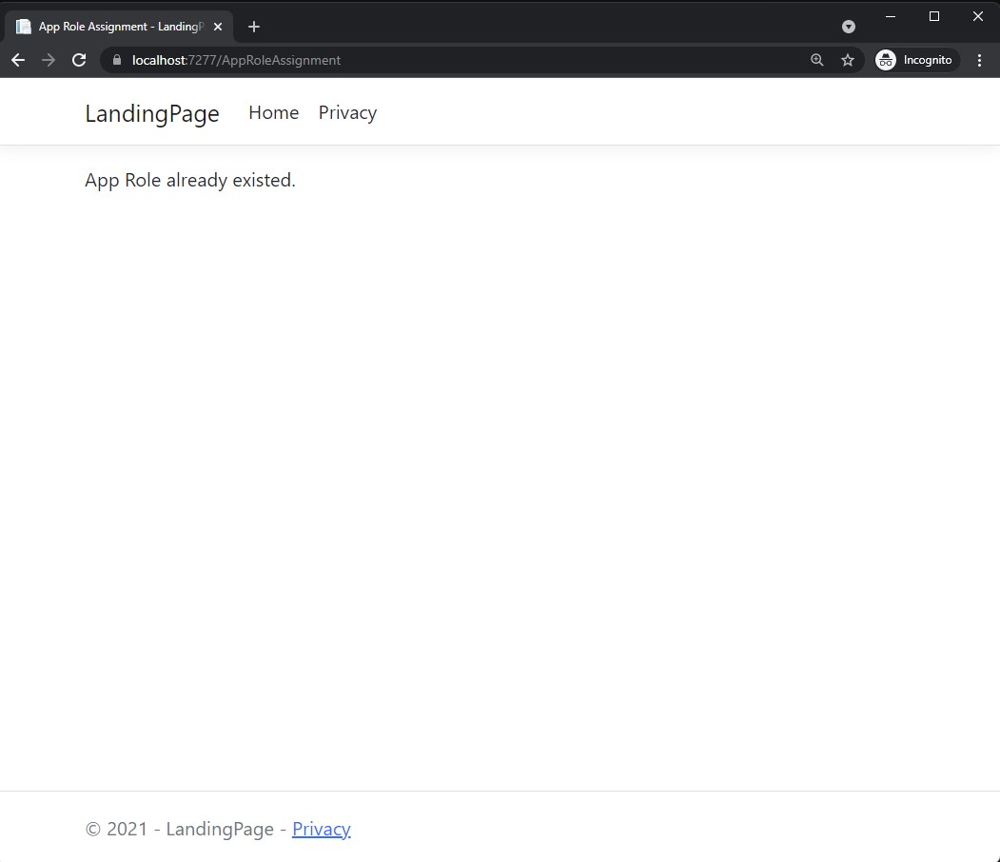
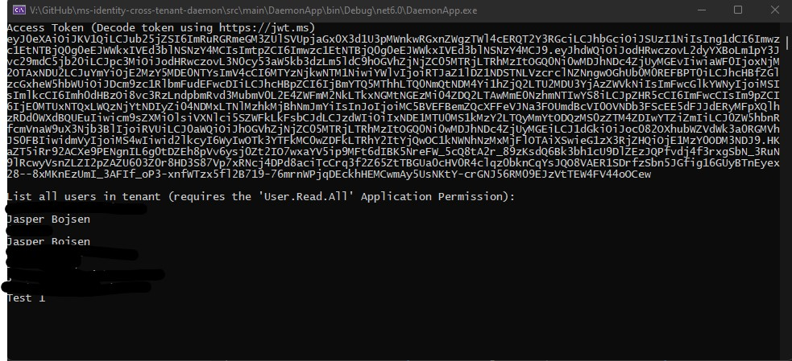
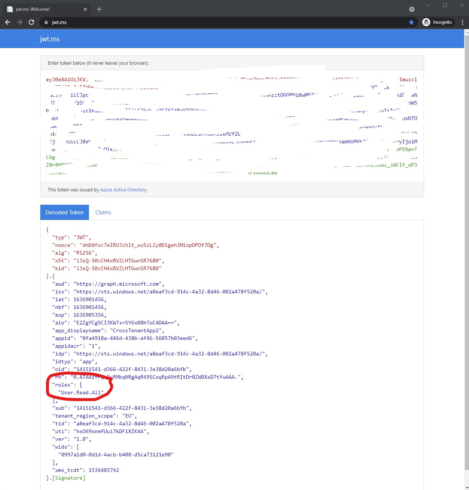

# Cross Tenant Daemon App Using Microsoft Identity Platform

## About this sample

This sample is written with [ASP.NET Core 6](https://devblogs.microsoft.com/dotnet/announcing-asp-net-core-in-net-6/) with [Razor](https://docs.microsoft.com/en-us/dotnet/architecture/porting-existing-aspnet-apps/comparing-razor-pages-aspnet-mvc) and [Microsoft Identity Web authentication library (Identity.Web)](https://docs.microsoft.com/en-us/azure/active-directory/develop/microsoft-identity-web). The Daemon app uses [Microsoft Authentication Library (MSAL)](https://docs.microsoft.com/en-us/azure/active-directory/develop/msal-overview).

### Overview

This sample shows how an ISV can create a SaaS app where customers can sign-up to for the app and the app can access customer data in a long-running and non-interactive way, providing that the customer provides their consent to access this data. 

The sign-up flow looks like this, at a high level:

1. The ISV creates a multi-tenant app registration in the ISV's home Azure AD tenant.
2. The customer signs up to the app by visiting a web app provided by the ISV - aka. **Landing Page**. 
2. Due to the long-running and non-interactive nature of the data access needed, it has to be an administrator from the customers own tenant that does the sign-up for the app.
3. As part of the app sign-up process, the customer administrator will be asked to consent to a set of delegate permissions. For more details about delegate and application permissions see: [Permission Types](https://docs.microsoft.com/en-us/azure/active-directory/develop/v2-permissions-and-consent#permission-types).
4. As the customer provide their consent to these delegate permissions, a [service principal](https://docs.microsoft.com/en-us/azure/active-directory/develop/app-objects-and-service-principals) for the ISV app will automatically be created in the customers own Azure AD tenant.
5. To ensure that the service principal have the needed application permissions to access data in a non-interactive sessions, one or more application permissions now need to be granted for this service principal. This process is typically referred to as: [App Role Assignment](https://docs.microsoft.com/en-us/graph/api/serviceprincipal-post-approleassignments?view=graph-rest-1.0&tabs=http). App role assignments can be done manually by the customer Azure administrator using for instance [az cli](https://docs.microsoft.com/en-us/cli/azure/), or it can be done from ISV's Landing Page web app on behalf of the user with Microsoft Graph, providing that the user have consented to the aforementioned delegate permissions.

After the sign-up process have been completed successfully, a daemon app can now be run by the ISV in the ISV's own Azure subscription - i.e., nothing need to be installed in the customers Azure subscription.

The daemon app will need the following settings to run:

- The tenant id of the customer Azure AD tenant.
- The AppId (aka. Client Id) of the app - i.e., the multi-tenant app registration created by the ISV.
- The Client Secret (or certificate) of the app - i.e., the multi-tenant app registration created by the ISV,

With these settings the daemon app is now able to use the [Microsoft Authentication Library (MSAL)](https://docs.microsoft.com/en-us/azure/active-directory/develop/msal-overview) to get an access token that can be used for for accessing the desired customer data.  

Notice that no client secrets (or certificates) need to be exchanged between the ISV and the customer for running the daemon app. This makes the approach secure and easy to manage for ISVs. Additionally, the customer remains in control, as the the custom can at any time delete the service principal for the app in the customers own tenant, which will revoke the daemon app's access and permissions.

### How to run this sample

To run this sample you'll need:

- Visual Studio 2022
- An internet connection
- Two Azure AD tenants. You can use your existing default Azure AD tenant and create a second free tenant if you do not already have a second one at hand. The process for creating a second Azure AD tenant is explained below.

#### Step 1: Clone this tenant

From your shell or command line:

```
git clone https://github.com/Azure-Samples/ms-identity-cross-tenant-daemon.git
```

... or download and exact the repository .zip file.

> Given that the name of the sample is pretty long, and so are the name of the referenced NuGet packages, you might want to clone it in a folder close to the root of your hard drive, to avoid file size limitations on Windows.

### Step 2: Create a second AD Tenant

To create a free Azure AD Tenant follow this [quickstart guide](https://docs.microsoft.com/en-us/azure/active-directory/fundamentals/active-directory-access-create-new-tenant).

Note down the tenant id and the domain name for the new tenant. We will use this new tenant as the home tenant for the app that we will be creating.

### Step 3: Create multi-tenant app registration

The multi-tenant app registration will be created in the new Azure AD tenant that was created in step 2.

We will be using [az cli](https://docs.microsoft.com/en-us/cli/azure/) and Linux bash to create the app registration. 

If you're running Windows 10 or 11 you can run bash in [WSL 2 (Windows Subsystem for Linux, version 2)]([Windows Subsystem for Linux Documentation | Microsoft Docs](https://docs.microsoft.com/en-us/windows/wsl/)). 

To install az cli, pick your OS:

- [Install the Azure CLI for Windows | Microsoft Docs](https://docs.microsoft.com/en-us/cli/azure/install-azure-cli-windows?tabs=azure-cli)
- [Install the Azure CLI on macOS | Microsoft Docs](https://docs.microsoft.com/en-us/cli/azure/install-azure-cli-macos)
- [Install the Azure CLI on Linux | Microsoft Docs](https://docs.microsoft.com/en-us/cli/azure/install-azure-cli-linux?pivots=apt)

If you've already installed az cli earlier, please ensure that you have the most recent version of az cli by running the command: ```az --version```. 

This samples was created with version 2.30.0. If you have an older version please run  ```az upgrade``` to upgrade to the latest version.

To sign into the second tenant you've just created, please use this az command:

````bash
az login --tenant <tenant id or primary domain name of newly created 2nd tenant> --allow-no-subscriptions
````

If successful this will output:

```json
[
  {
    "cloudName": "AzureCloud",
    "id": "<some guid>",
    "isDefault": true,
    "name": "N/A(tenant level account)",
    "state": "Enabled",
    "tenantId": "<some guid>",
    "user": {
      "name": "user@name.net",
      "type": "user"
    }
  }
]
```

Now let's create the multi-tenant app registration for the multi-tenant app, by running these bash/az commands:

```bash
appId="$( az ad app create \
    --display-name "Daemon Cross Tenant App" \
    --available-to-other-tenants true \
    --oauth2-allow-implicit-flow false \
    --reply-urls \
        "https://localhost" \
        "https://localhost/signin-oidc" \
        --query "appId" -o tsv )"
echo "appId: $appId"
```

This will output the appId GUID of the created multi-tenant app, and save it to an environment variable in your bash session. Note that the ```--query "appId" -o tsv``` will extract the appId from the resulting output of the ```az ad app create``` command.

The Microsoft Graph delegate permissions we want to add to the app are:

| Permission                      | Description                                                  | Admin Consent needed |
| ------------------------------- | ------------------------------------------------------------ | -------------------- |
| openid                          | Allows you to sign in to the app with your work or school account and allows the app to read your basic profile information. | No                   |
| User.Read                       | Allows you to sign in to the app with your organizational account and let the app read your profile. It also allows the app to read basic company information. | No                   |
| Application.Read.All            | Allows the app to read applications and service principals on behalf of the signed-in user. | Yes                  |
| AppRoleAssignment.ReadWrite.All | Allows the app to manage permission grants for application permissions to any API (including Microsoft Graph) and application assignments for any app, on behalf of the signed-in user. | Yes                  |

To add the necessary Microsoft Graph delegate permissions to the app we first need to get the resource ids for these delegate permissions. 

Run these bash commands to get all the Microsoft Graph Permissions Ids that is needed for the app, and save them to environment variables in your bash session:

```bash
graphClientId="00000003-0000-0000-c000-000000000000"

openid="$( az ad sp show --id $graphClientId --query "oauth2Permissions[?value=='openid'].id" -o tsv )"

userReadId="$( az ad sp show --id $graphClientId --query "oauth2Permissions[?value=='User.Read'].id" -o tsv )"

appReadAllId="$( az ad sp show --id $graphClientId --query "oauth2Permissions[?value=='Application.Read.All'].id" -o tsv )"

appRoleAssignReadWriteAllId="$( az ad sp show --id $graphClientId --query "oauth2Permissions[?value=='AppRoleAssignment.ReadWrite.All'].id" -o tsv )"

echo "openid: $openid"
echo "User.Read: $userReadId"
echo "Application.Read.All: $appReadAllId"
echo "AppRoleAssignment.ReadWrite.All: $appRoleAssignReadWriteAllId"
```

Too add the delegate permissions to the app registration run these az commands in bash:

```bash
az ad app permission add --id $appId \
  --api $graphClientId \
  --api-permissions $openid=Scope
  
az ad app permission add --id $appId \
  --api $graphClientId \
  --api-permissions $userReadId=Scope
  
az ad app permission add --id $appId \
  --api $graphClientId \
  --api-permissions $appReadAllId=Scope
  
az ad app permission add --id $appId \
  --api $graphClientId \
  --api-permissions $appRoleAssignReadWriteAllId=Scope
```

The final step we need to complete for our app registration to be complete is to get a ```client secret``` (or a certificate) that our landing page web app and our daemon will use as credentials.   

To get a client secret run this az command:

```bash
az ad app credential reset --id $appId
```

This will output: 

```json
{
  "appId": "<AppId>",
  "name": "<GUID>",
  "password": "<client secret>",
  "tenant": "<Tenant ID>"
}
```

Note down the value of password, as you will need it in a minute, and there is no way to request it again. If you loose it, you can however run the az command again to create a new.

Now if you visit the Azure Portal and switch to your newly created tenant you should see the new App Registration under **App Registrations** in the Azure Active Directory. If you don't see it, choose the **All applications** tab.

Authentication will look like this:

API Permissions will look like this:

### Step 4:  Configure the landing page web app and the daemon app

Now we are ready to complete the configuration of the two Visual Studio projects - i.e., the LandingPage web app and the DaemonApp console app. 

1. Open the CrossTenant solution in Visual Studio 2022.

2. In the LandingPage Project copy the file ```appsettings.json``` to a new file and name it ```appsettings.Development.json```.

3. Edit the new file ```appsettings.Development.json``` to fill out the three missing values for the `AzureAdAppRegistration` object:

   ```json
   {
     "Logging": {
       "LogLevel": {
         "Default": "Information",
         "Microsoft.AspNetCore": "Warning"
       }
     },
     "AllowedHosts": "*",
     "AzureAdAppRegistration": {
       "Instance": "https://login.microsoftonline.com/",
       "TenantId": "organizations",
       "Domain": "<domain name of newly created tenant - somthing.onmicrosoft.com>", // 1
       "ClientId": "<appId of created multi-tenant app>", // 2
       "ClientSecret": "<client secret credentials for multi-tenant app>", // 3
       "CallbackPath": "/signin-oidc",
       "Scopes": ".default"
     },
     "MSGraphSettings": {
       "BaseUrl": "https://graph.microsoft.com/v1.0",
       "Scopes": "User.Read AppRoleAssignment.ReadWrite.All Application.Read.All"
     },
     "DaemonPermissions": {
       "Scopes": "User.Read.All"
     }
   }
   ```

   **Note:** Notice that there is a relative link to the `appsettings.Development.json` file in the LandingPage project in the DaemonApp Project. None of the two projects will be able to run successfully before this file has been created. For details see `DaemonApp.csproj`:

   ```xml
   ...
   <ItemGroup>
       <Content Include="..\landingPage\appsettings.Development.json" Link="appsettings.Development.json" CopyToOutputDirectory="PreserveNewest" />
   </ItemGroup>
   ...
   ```

4. The final step is to open the file `daemonAppSettings.json` file in the DaemonApp Project. In this file add the tenant id for the user that will sigh-up for the ISV app. If you have administrator rights in you default Azure tenant, then you could log in with your default user or a user created in that tenant. If not, you can create yet another free Azure AD tenant that you control and create a user in that tenant that you can use for testing the cross tenant daemon app.

   ```json
   {
     "DaemonAppSettings": {    
       "TenantId": "<tenant id of your default tenant or some other tentant that is NOT the newly created tenant with the multi-tenant app registration you just created"
     }
   }
   ```

   > TIP: The LandingPage web app will display the tenant of the user you sign in with. 

### Step 5: Running the sample

> TIP: When you launch the LandingPage web app, do so with a browser in [incognito mode](https://www.hanselman.com/blog/visual-studio-web-development-tip-add-chrome-incognito-mode-as-a-browser). This way you avoid issues with already logged in users and cached tokens. 

To run the sample, first run the LandingPage web app. 







Now run the DaemonApp console app, which will show something like this:



The JWT access token can be explored using https://jwt.ms. Notice that the access token includes the app role assignment `User.Read.All`, as requested in the app. 



### Step 6: Go explorer the code

Voila! Happy coding.

